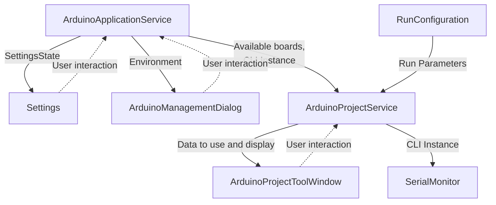

# Arduino support for Intellij CLion
This plugin adds support for Arduino C/C++ development to [JetBrains CLion IDE](https://www.jetbrains.com/clion/).

## Features
// TODO

## Installation
// TODO

## Tutorial
// TODO: everything

Create a new sketch

// TODO

Verify / Upload

// TODO

Serial Monitor

// TODO

Libraries / Board Manager

// TODO

## Screenshots
// TODO

# Development
## Global Plugin Structure

- `ArduinoApplicationService`

    This service is here for all non-project relative actions. It provides access to the Arduino environment
configuration and the non projects settings (libraries manager, board manager, projects...). It also manages instances and access to the Arduino CLI and connected boards for 
projects. This service uses direct command lines calls to the Arduino CLI.

- `ArduinoProjectService`

    This service is here for all project relative actions. It retrieves a remote gRPC instance of the Arduino CLI from 
the `ArduinoApplicationService`. This service provide the user access to the Serial Monitor, Upload and Verify features
and is responsible for the project configuration (libraries, boards, include paths, etc...). This service uses gRPC calls to the
Arduino CLI.

- `ArduinoManagementDialog`

    This dialog is here to provide the user a library and a board manager as he was used to in the arduino IDE.
Interact mostly with the `ArduinoApplicationService` data's.

- **Run configuration**

    Here the user can modify the options for the Verify and Upload actions like the board, the port and the programmer.
There are two configurations available : Verify and Upload.

- **Arduino Project Tool Window**

    Here the user can quickly change the board, port and programmer without having to open the run configuration dialog.
The user can include libraries as he was used to in the arduino IDE.
This tool window also provides quick access to the Serial Monitor, the Library / Board Manager and the settings.

- **Serial Monitor Tool Window**

    This tool window is here to provide the user a serial monitor. It uses the `ArduinoProjectService` to retrieve the
serial monitor data's.

- **Settings**

    The settings page is used to configure the Arduino CLI path, default projects settings and some other things that
 are not clearly defined yet.

- **Project Structure**

    Arduino project creation like any project in CLion.

